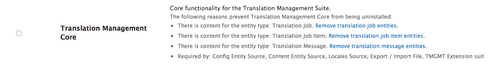

# gtranslate_url_addon
<h3>Recording steps here to set up GTranslate</h3>
<h4>Prep</h4>
<ol style="margin-left:1em;">
    <li>Download <a href="http://gtranslate.net/downloads/gtranslate_url_addon.zip">GTranslate URL add-on</a> and unzip it</li>
    <li>Update this repo (gtranslate_url_addon) to keep our local copy current</li>
    <li>Edit gtranslate/config.php file to set correct main_lang language code: <code>$main_lang = 'en';</code></li>
    <li>Copy the <strong>gtranlate</strong> folder to the <strong>web</strong> folder under the root of the branch</li>
    <li>Copy the <strong>.platform.app.yaml</strong> repo from this repo to root directory of the branch (MacOS doesn't like you overwriting "system" files whose names start with `.` so you have to open the files and copy the gtranslate lines to file in the site repo -- I found Kaleidoscope handy to do this, to make sure everything else was identical)</li>
</ol>
<h4>Drupal admin</h4>
<ol>
  <li>Uninstall modules:
<ul>
  <li>Smartling Context Debugger</li>
  <li>Smartling Translator</li>
  <li></li>
</ul>
  </li>
</ol>
